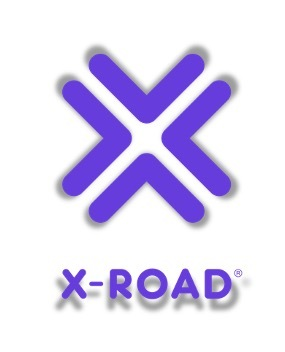
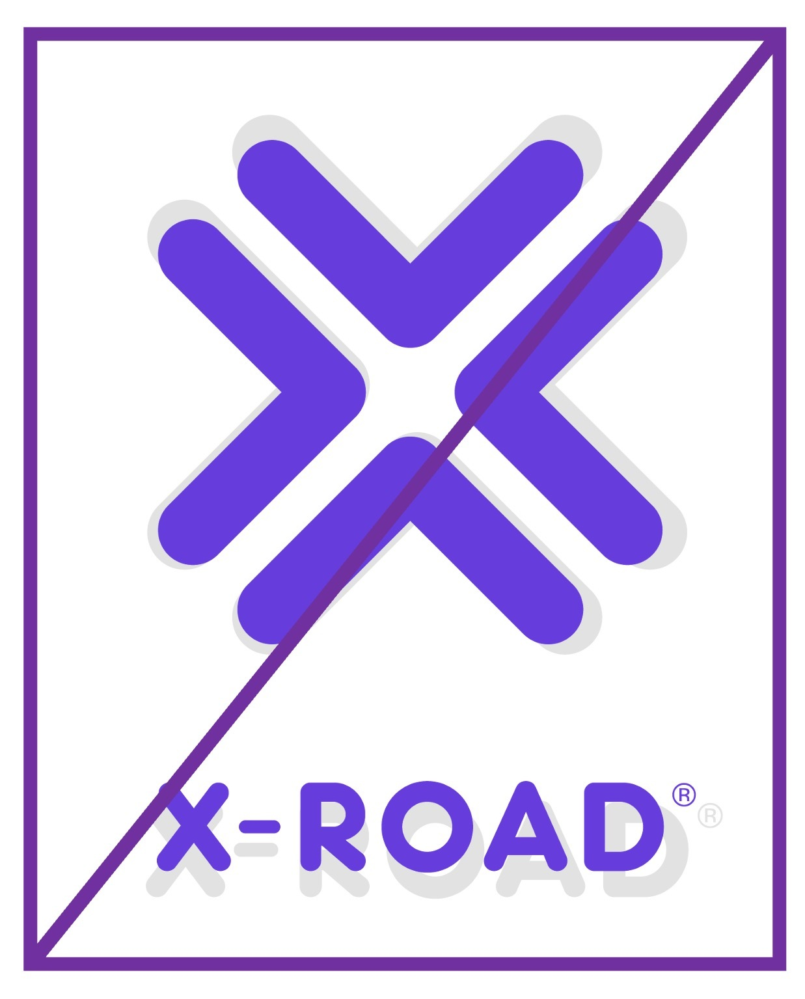
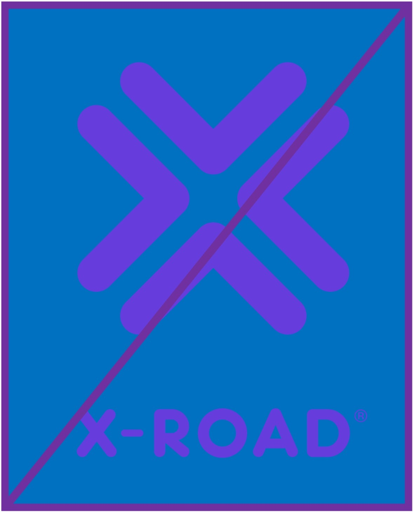
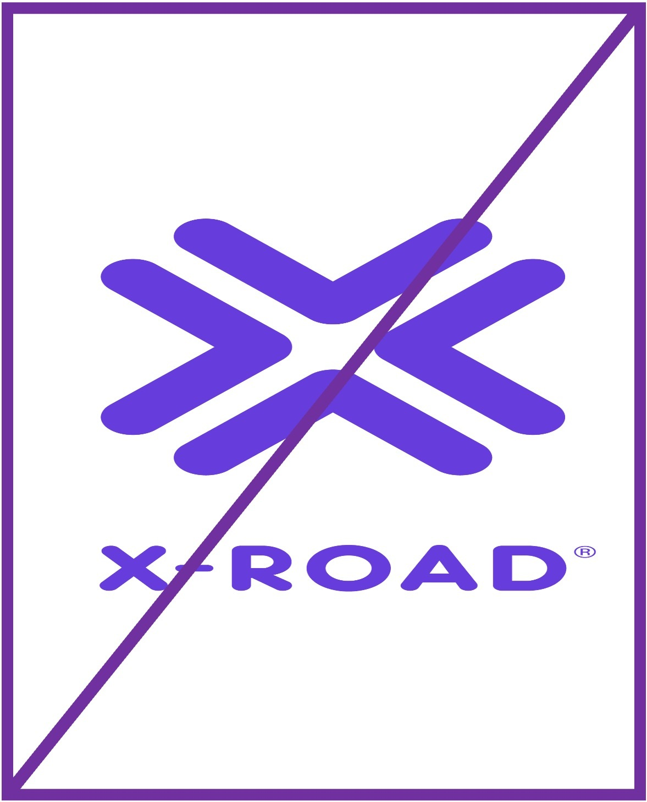
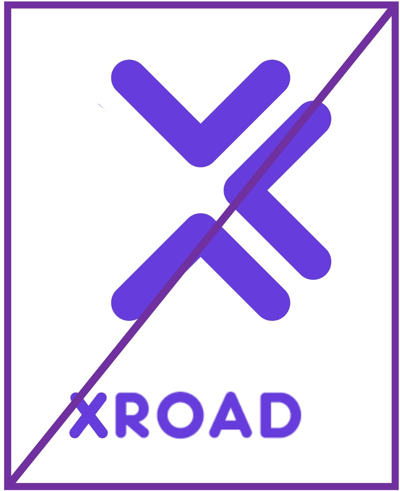
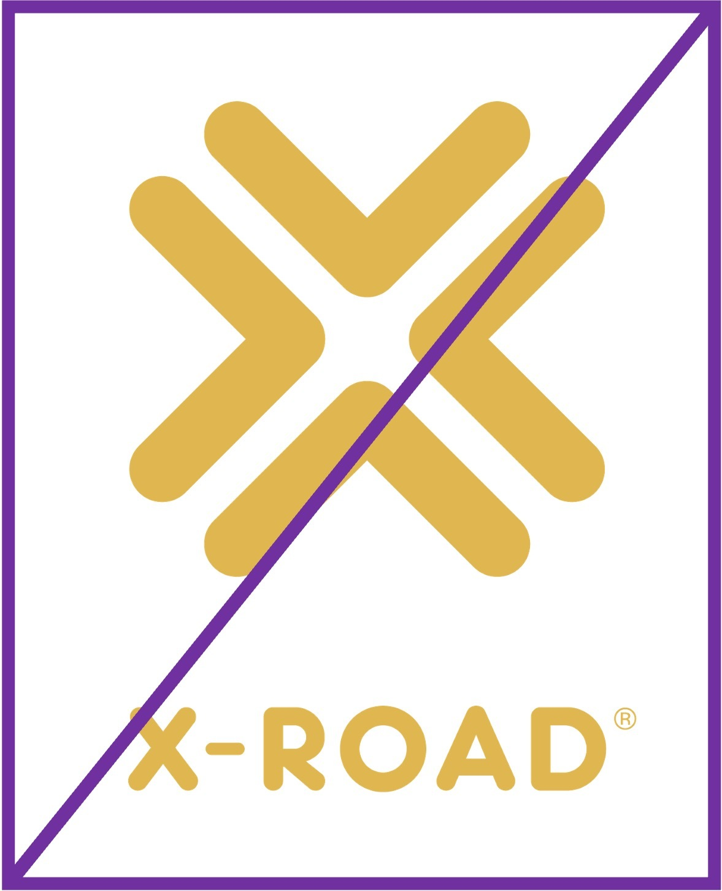
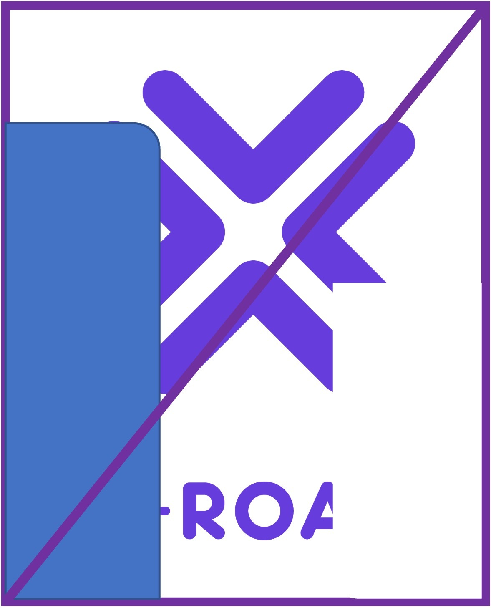

# NIIS® and X-ROAD® TRADEMARK USAGE GUIDELINES

**NIIS®** Nordic Institute for Interoperability Solutions is a European Union Trade Mark (no 017625484) registered by
the European Union Intellectual Property Office for NIIS.

**X-Road®** is a European Union trademark (no 1025499) registered by the European Union Intellectual Property Office
and an Estonian trademark (no M200900641) registered by the Estonian Patent Office for the Estonian Information System
Authority (RIA) and managed and sub-licensed by NIIS.

For purposes of this document, references to trademarks or marks include all trade and service marks and logos owned or
managed by NIIS legal entity. If such a need arises from the context, the words used in the guidelines in a singular
form may be interpreted in the plural and vice versa.

## Table of Contents

* [1 Trademark Usage Guidelines](#1-trademark-usage-guidelines)
* [2 Fair Use of Trademarks and Logos](#2-fair-use-of-trademarks-and-logos)
* [3 Correct and Incorrect Examples of Use](#3-correct-and-incorrect-examples-of-use)
* [4 Questions and Comments](#4-questions-and-comments)
* [5 Updates of Guidelines](#5-updates-of-guidelines)
* [6 Q&A](#q&a)

## 1 Trademark Usage Guidelines

1. These guidelines are for NIIS licensees, developers, and other parties wishing to use the trademarks or images in
promotional, advertising, instructional, or reference materials or on their websites.
2. NIIS takes great care to develop and protect its trademarks and reserves all ownership rights of its trademarks.
If we think that your use of the trademarks violates any of our agreement terms or these guidelines, or if we feel
that your use isn’t in NIIS’s best interest, we can revoke your right to use our trademarks at any time.
3. If you are a licensee of trademarks and have been provided with special trademark usage guidelines with your
license agreement, please follow those in addition to these guidelines. If your license agreement does not provide
usage guidelines in matters not regulated in the agreement, follow these guidelines.
4. Open-source license vs trademarks. The open-source MIT License allows you to redistribute and use the software
under certain conditions. Nevertheless, the MIT License does not include an implied right or license to use a
trademark related to the licensed software or other materials. The trademarks and logos need to be used consistent
with trademark law.
5. You may apply for the conclusion of the license agreement and use of the X-ROAD trademarks only if you are a 
[technology partner of X-ROAD](https://x-road.global/xroad-technology-partners-companies), i.e. if you have been
involved in developing X-ROAD and adhere to the conditions set out on our webpage. The usage of X-ROAD trademarks
is permitted only by a license agreement between X-ROAD and the aforementioned license applicant.
6. The X-Road documentation is licensed under the 
[Creative Commons Attribution-ShareAlike 3.0 Unported License](http://creativecommons.org/licenses/by-sa/3.0).

## 2 Fair Use of Trademarks and Logos

1. “Fair use” of NIIS trademarks, used by a third party without express permission or license, is limited to text-only
   references to NIIS trademarks and excludes the use of trademark logos.
2. In such references, you must not mislead the public. You must be clear and accurate about the nature of NIIS and
   your company's relationship and add a clear reference to the registered trademark using a trademark symbol (®) and
   ownership of the trademark. Trademark law permits third parties to use a mark to identify the trademark holder’s
   product or service so long as such use is not likely to cause unnecessary consumer or public confusion (e.g.,
   untruthful advertising, false/misleading promotional materials, etc.).
3. The following are two common types of fair use:
   1. When you are specifically referring to NIIS products, for example, X-Road® Data Exchange Layer software is used
      in company XYZ for data exchange. X-Road® is a registered trademark of the Estonian Information System Authority.
   2. When you indicate that a NIIS product is compatible with another product, for example, XYZ product is compatible
      with X-Road® Data Exchange Layer software. X-Road® is a registered trademark of the Estonian Information System
      Authority.
   3. You should emphasize your product name so that it is perceived as an application, developed with, compatible
      with, or running on a NIIS solution.
   4. You should use the trademarks in a form that distinguishes them from the text around them, such as by
      capitalization, bold or italic fonts, or quotation marks.
4. NIIS carefully limits the use of its trademark logos. Do not make unlicensed use of the trademark logos, as using
   the trademark logos requires a license or written permission from NIIS (e.g. the cover of a book or magazine,
   posters, brochures, signs, websites, or other marketing materials to promote your events, products or services,
   etc.).
5. You may reference X-ROAD services using the X-ROAD trademark, so long as such references are: (1) truthful, fair,
   and not misleading, and (2) comply with the agreement and these guidelines.
6. The trademarks should never be used in a way that could wrongly cause anyone to believe that your products or
   services are offered, endorsed, or sponsored by NIIS or X-ROAD. You must avoid confusion
   regarding the NIIS products and the trademarks.
7. You may use the trademarks only as adjectives followed by the appropriate generic noun. The trademarks should not be
   used in the plural or possessive form or as verbs.
8. You may not assert rights over any of the trademarks, whether by incorporating a trademark or brand into your
   product or service names, trademarks, logos, company names, or domain names or seeking a trademark or domain name
   registration for any term that includes the trademark.
9. When using trademarks: (i) use the trademarks exactly as they appear and do not alter or distort their appearance in
   any way; (ii) allow for clear space around the trademarks; and (iii) maintain the legibility of the trademarks and
   keep them sharp, clear, and well-produced.
10. You may not use the trademarks in a disparaging or degrading manner.

## 3 Correct and Incorrect Examples of Use

### 1 The following are examples of proper and improper usage of these trademarks of NIIS:

- Correct: \<your product name\> for \<NIIS Trademarks and Logos\>
- Correct: \<your product/company name\> plug-in for \<NIIS Trademarks and Logos\>
- Correct: \<your product name\> compatible with \<NIIS Trademarks and Logos\>
- Correct: \<your product name\> for use with \<NIIS Trademarks and Logos \>
- Incorrect: \<NIIS Trademarks and Logos\> \<your product name\>
- Incorrect: \<NIIS Trademarks and Logos\> by \<your company name\>
- Incorrect: \<NIIS Trademarks and Logos\> – \<your product name\>
- Incorrect: \<your product/company name\> – \<NIIS Trademarks and Logos\>

### 2 Here are examples of correct logos (noting that any actual use must also comply with the other requirements described in CVI’s). For proper usage and how to determine clear space (logo safe area), ask for the logo’s CVI from NIIS (info@niis.org):

|                          NIIS                           |                                                                X-ROAD                                                                |
| :-----------------------------------------------------: | :----------------------------------------------------------------------------------------------------------------------------------: |
|  | The X-ROAD logo is a graphic whole consisting of a logotype and logomark. The registered trademark symbol forms part of the logo. |
|  |                                                                                |
|  |                                                                                                                                      |

### 3 Here are examples of incorrect logos. The logo should not be altered in any way. Do not add, remove, or resize any elements or colours of the existing logo, X-ROAD logo, for example:

|                                                                                                                        |                                                                                                                     |                                                                                                                                |                                                                                                                                            |
| :--------------------------------------------------------------------------------------------------------------------: | :-----------------------------------------------------------------------------------------------------------------: | :----------------------------------------------------------------------------------------------------------------------------: | :----------------------------------------------------------------------------------------------------------------------------------------: |
|  Don’t add outlines, special effects, or other graphic elements. |  Don’t alter or add copy to the logo. Don’t change the fonts. |  Make sure the logo is entirely legible and on a contrasting background. |                                Don’t distort the logo.                               |
|               Don’t change or remove logo elements.              |             Don’t change the colours of the logo.             |                       Don’t put the logo in shape.                       |  Don’t allow the logo to get cut off or be covered. The entire logo must be visible. |

## 4 Questions and Comments

In case of questions about these guidelines, if you are interested in obtaining a license to use the trademarks, or to
report concerns regarding the use or misuse of the trademarks of NIIS, contact us at <info@niis.org>.

## 5 Updates of Guidelines

The NIIS® and X-ROAD® Trademark Usage Guidelines may be modified from time to time by NIIS
at our sole discretion and release new versions without notice. The current version is 2022 v1, published in December
2022.

## 6 Q&A

1. **Question**: Does this also mean that if I compile X-Road (without changing any actual code) and create my metapackages to distribute in a country, for instance, I should always modify the frontend code and remove the X-Road logos?
   1. **Answer**: In this case, you don’t need to remove the X-Road logos from the frontend because you’re still using the original X-Road software. However, the national data exchange service that’s built using X-Road should be called something else.
